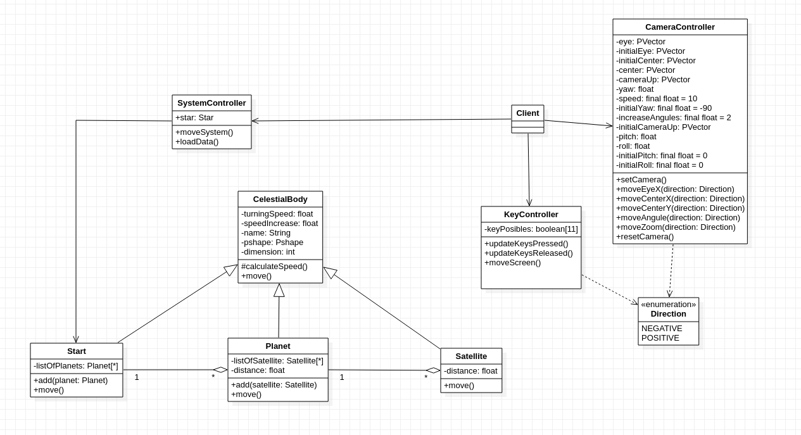

# Solar-System-Camera


## Autor
Miguel Ángel Medina Ramírez <br>
Correo: miguel.medina108@alu.ulpgc.es

## Índice
1. [Introducción](#introducción)
2. [Demostración](#demostración)
3. [Dependencias](#dependencias)
4. [Implementación](#implementación)<br>
 4.1. [Diseño de clases](#diseño-de-clases)<br>
 4.2. [Transformaciones y rotación](#transformaciones-y-rotación)<br>
 4.3. [Modelo de camara](#modelo-de-camara)<br>
 4.4. [Ocultación](#ocultación)<br>
5. [Eventos y Controles](#eventos-y-controles)
6. [Bibliografía](#bibliografía)

## Introducción
Esta práctica consiste en diseñar un modelo de cámara para el sistema planetario de la práctica anterior. Se ha optado por diseñar una vista en primera persona simulando la navegación de una nave espacial.

## Demostración
<p align="center"> 
   </img>
   <p align="center">Figura 1: Gif de demostración</p>
</p>

## Dependencias
Para poder ejecutar y probar la práctica solamente se necesita clonar este repositorio y el editor de processing con la siguiente dependencia:
- La librería **GifAnimation** para poder reproducir y guardar gifs. Como esta librería no forma parte necesaria para la correcta implementación de la práctica, en el código toda la lógica relacionada con ella se encuentra comentada, además de que afecta al rendimiento de la aplicación.En este [enlace](https://github.com/extrapixel/gif-animation) se encuentra la forma de instalarla.

## Implementación
Se ha empleado el patrón de diseño **Composite** para implementar la relaciones entre los astros planetarios.Además se han añadido un nuevo controlador para la lógica de la camara y la clase *Point* para  ayudar al movimiento de la misma.

### Diseño de clases
<p align="center"> 
   </img>
   <p align="center">Figura 2: Diagrama de clases</p>
</p>

### Transformaciones y rotación

El método *move* es el encargado de implementar la lógica necesaria para representar los astros, además de haceros girar y moverse. Se han usado las primitivas básicas de processing como *pushMatrix*, *popMatrix*, *rotate* y *translate* para implementar el movimiento y rotación simulando el comportamiento de los planetas.

Para las estrellas:

```java
  @Override
  public void move(){
    pushMatrix();
    rotateY(radians(super.turningSpeed));
    text(super.name,0,-super.dimension*2);
    shape(super.pshape);
    popMatrix();
    for(Planet planet:listOfPlanets){
      planet.move();
    }
    super.calculateSpeed();
  }
```

Para los planetas:

```java
  @Override
  public void move(){
    pushMatrix();
    rotateY(radians(super.turningSpeed));
    translate(distance,0,0);
    rotateY(radians(super.turningSpeed));
    text(super.name,0,-super.dimension*2);
    shape(super.pshape);
    for(Satellite satellite:listOfSatellite){
      satellite.move();
    }
    popMatrix();
    super.calculateSpeed();
  }
```

Para los satélites:

```java
  @Override
  public void move(){
    pushMatrix();
    rotateY(radians(super.turningSpeed));
    translate(distance,0,0);
    rotateY(radians(super.turningSpeed));
    text(super.name,0,-super.dimension*2);
    shape(super.pshape);
    popMatrix();
    super.calculateSpeed();
  }
```
## Modelo de camara
El modelo que se busca para la nave es tener una camara en primera persona, para ello el método *camera* nos ofrece tres puntos para controlar:

 * eye: Coordenadas para controlar la posición del ojo con respecto al sistema observable
 * center: Coordedas que represetan al observador
 * up: El vector vértical se usa para inducir un ángulo de inclinación a la camara
 
Para tener un modelo de primera persona lo que se petendre es que el punto observable se mueva cada vez que se mueva el ojo  teniendo un efecto de movimiento continuo para 

## Ocultación

## Eventos y Controles

<table style="width:100%">
  <tr>
    <th>Tecla</th>
    <th>Uso</th>
  </tr>
  <tr>
    <td>w</td>
    <td>Mueve la nave en el eje Z, hacia delante</td>
  </tr>
  <tr>
    <td>s</td>
    <td>Mueve la nave en el eje Z, hacia atrás</td>
  </tr>
  <tr>
    <td>a</td>
    <td>Mueve la nave en el eje X, hacia izquierda</td>
  </tr>
  <tr>
    <td>d</td>
    <td>Mueve la nave en el eje X, hacia derecha</td>
  </tr>
  <tr>
    <td>Flechas del teclado</td>
    <td>Mover el ángulo de visión de la camara</td>
  </tr>
  <tr>
    <td>r</td>
    <td>Eleva la nave en el eje Y</td>
  </tr>
  <tr>
    <td>f</td>
    <td>Baja la nave en el eje Y</td>
  </tr>
  <tr>
    <td>o</td>
    <td>Inclina la nave hacia la derecha, se puede dar una vuelta completa</td>
  </tr>
  <tr>
    <td>p</td>
    <td>Inclina la nave hacia la izquierda, se puede dar una vuelta completa</td>
  </tr>
</table>

## Bibliografía

* [Guion de prácticas](https://cv-aep.ulpgc.es/cv/ulpgctp20/pluginfile.php/126724/mod_resource/content/22/CIU_Pr_cticas.pdf)
* [processing.org](https://processing.org/)
* [rotaciones](https://en.wikipedia.org/wiki/Rotation_(mathematics))
